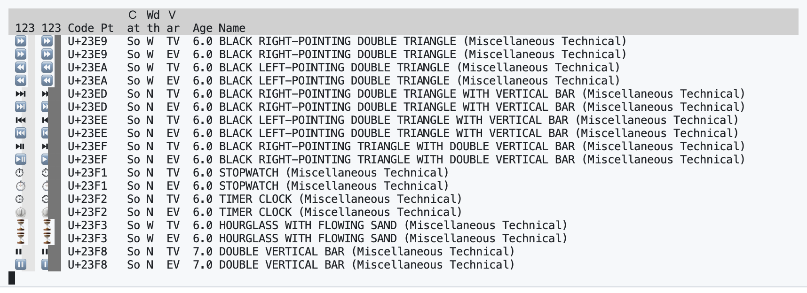
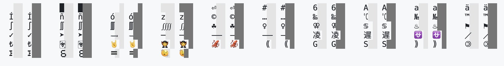

# It's Not Unicode, It's Hemi-Semi-Demicode!

Computing technology certainly has come a long way over the last 50 years. For
instance, where bulky, heavy, monochrome [CRT
displays](https://en.wikipedia.org/wiki/Cathode-ray_tube) capable of rendering
only fixed-width characters have been replaced by thin, portable,
high-resolution, wide-gamut LCD displays capable of rendering sophisticated 2D
and 3D graphics. Yet software engineers, scientists, and other professionals
still spend much of their time in applications that [display
text](https://en.wikipedia.org/wiki/Terminal_emulator) [in
fixed-width](https://en.wikipedia.org/wiki/Source-code_editor) [character
grids](https://en.wikipedia.org/wiki/Notebook_interface). To style that text,
they rely on the exact same control sequences developed for CRT-based terminals
50 years ago. That works well enough for English text encoded as
[ASCII](https://en.wikipedia.org/wiki/ASCII), but it fails for the full range of
human writing represented as [Unicode](https://home.unicode.org/) including
mathematical symbols and emoji.


## The State-of-the-Art …

The problem boils down to the fact that Latin letters, even when allowing for
the various diacritics adoring basic letter forms in European languages, mostly
fit into a fixed-width grid of uniform width. However, that distinctly is not
the case for CJK, Chinese, Japanese, and Korean, and it gets only harder for
other scripts, notably Arabic, which is an alphabetic script but written in a
cursive style that varies the appearance of letters depending on local context.
Simply isolating individual letters into a fixed-width grid is not an acceptable
approach to render Arabic text. As an extreme example, this Arabic ligature
﷽ is a single code point in Unicode. It obviously takes up a lot of columns.
Apparently, it is the widest code point in all of Unicode. But even if we stay
within the Latin script, mathematical notation has become ubiquitous in
engineering and science and emoji are a global lingua franca by now. Many such
symbols and ideographs require more than one column on fixed-width displays, yet
they frequently are squushed into a single column.

Unicode includes some support for accommodating wider characters based on
conventions estebalished for CJK. Under this model, characters are either
*narrow* or *wide*, i.e., take up one or two columns on the fixed-width grid. In
general, Latin characters are narrow and CJK characters are wide. But Unicode
also includes special narrow forms for some CJK characters and wide forms for
Latin characters. The standard's [*East Asian
Width*](https://www.unicode.org/reports/tr11/tr11-40.html) property maps all
valid code points to *Fullwidth* and *Wide* for double-column display,
*Halfwidth* and *Narrow* for single-column display, *Ambiguous* for
context-dependent width, and *Neutral* for what effectively also becomes
single-column display.

In addition to Unicode, the POSIX standard for operating systems includes the
[`wcwidth`](https://pubs.opengroup.org/onlinepubs/9699919799/functions/wcwidth.html)
function as an extension. It is supposed to return the column width of a
character, using 0 for a "null wide-character code" and -1 if the character
"does not correspond to a printable wide-character code." Interestingly, the
description does *not* specify a maximum width. It only says to return "the
number of column positions to be occupied by the wide-character code." That's
pretty much as far as the Open Group went in specifying `wcwidth`, i.e., it's
not particularly helpful. In contrast, Markus Kuhn's [open source
implementation](https://www.cl.cam.ac.uk/~mgk25/ucs/wcwidth.c) based on Unicode
5.0 does much better. Despite the fact that it is written in low-level C code,
it takes up only 310 lines and most of them are helpful comments and inline
tables for Unicode properties. The latter encode which code points fall into
Unicode's `Cf`, `Me`, and `Mn` general categories and hence are zero-width and
which code points fall into Unicode's `F` and `W` East Asian widths and hence
are double-width.


## … Is a Hot Mess

Sticking to the Latin script, mathematical symbols, and emoji, here are some
concrete examples for where the state-of-the-art fails at fixed-width rendering:

  * To be filled in...


More generally, Unicode's assignment of `F` and `W` for the East Asian Width
property is an incoherent and inconsistent mess. To see how big a mess, clone
this repository and run

```sh
% python -m demicode --with-variation
```

with Python 3.11. Demicode will display all Unicode code points that support
both text and emoji variation with both variations. For the 12 code points that
can further be combined with U+20E3 into a keycap sequence, it also displays
that sequence.



As illustrated in the above screenshot, demicode displays two groups for each
code point that are three columns wide. In each group, it displays the character
of interest followed by padding to three columns based on the `wcwidth()`
algorithm. For the first group, the padding are lightly colored spaces U+0020,
which serve as background for characters that are wider than they should be. For
the second group, the padding are darkly colored full blocks █ U+2588, which
serve as foreground over characters that are wider than they should be. If
characters are narrower than they should be, the padding does not line up on the
right side.

After the two three-column groups, demicode shows

  * the hexadecimal value of the code point,
  * its general Unicode category,
  * its East Asian width,
  * whether it includes a text or emoji variation selector,
  * the Unicode version that first assigned the code point,
  * and its name followed by its block in parentheses.

As the example demonstrates, Visual Studio Code's terminal on macOS is robust
enough to preserve the columns. It also observes text vs emoji variations for
some code points but not nearly all of them. Finally, `wcwidth` and East Asian
width are wildly inconsistent, with even code points in the same block and
introduced by the same version diverging on width. Compare, for example, the
black right-pointing double triangle ⏩︎ U+23E9 U+FE0E and ⏩️ U+23E9 U+FE0F with
the black right-pointing double triangle *with vertical bar* ⏭︎ U+23ED U+FE0E
and ⏭️ U+23ED U+FE0F. Funnily enough, those are outliers amongst the code points
introduced with Unicode 6.0, which overall have far better width assignments
than those for code points introduced with other versions. It really makes me
wonder what triggered this difference.



Demicode also supports `--as-grid` for a considerably more compact presentation
that omits all the Unicode properties. The example above illustrates the output
for the current, very much preliminary version of `--with-selection`, which
eventually will feature a representative sample from across the range of code
points and Unicode versions. As you can see there as well, some characters get
ample breathing space—notice the vampire 🧛 U+1F9DB, the squid  🦑 U+1F991, and
the full-width double parentheses ｟ U+FF5F and U+FF60 ｠. Other characters are
partially obscured, including the keycaps sequences #️⃣ U+0023 U+FE0F U+20E3 and
6️⃣ U+0036 U+FE0F U+20E3, the quadruple integral operator ⨌ U+2A0C, the doubled
female sign ⚢ U+26A2, the long rightwards squiggle arrow ⟿ U+27FF, and the
segmented digit six 🯶 U+1FBF6.

It is [凌遲](https://en.wikipedia.org/wiki/Lingchi), indeed!


## A Hint of Arab Spring?

But there are signs that the Unicode technical committee is ready to consider
ways out of this mess. Prodded by a [pretty impressive
proposal](https://www.unicode.org/L2/L2023/23107-terminal-suppt.pdf) from
Microsoft, an ad-hoc working group is now considering, well, something. I had
originally prepared a far more flashy "*Fixed-Width Rendering Challenge*." But
when I discovered the Unicode effort, I figured quiet and constructive is the
way to go. I'll update this document if and when I learn new things.

---

## Demicode

The project name is a play on the fact that fixed-width rendering of Unicode
can't get by with a *uni*-column—from the Latin *unus* for one—but requires a
*demi*-view—from the Latin *dimidius* for half via the French *demi* also for
half. As so happens, *hemi* and *semi* mean half as well, tracing back to Greek
and Latin origin, respectively. Alas, I can't make up a mind whether
hemisemidemi is divisive (i.e., 1/8) or just reinforcing (i.e., still 1/2).

If you look at the tool's code, you'll notice that it does *not* make use of the
`unicodedata` module from Python's standard library. That is very much
intentional and in interest of quality as well as flexibility. The Python module
is locked at recent version, Unicode 14.0 in case of Python 3.11.1, and is
incomplete, omitting for example code points with text vs emoji variation, the
age of code points, and the block of code points. Instead, demicode downloads
necessary Unicode files when first needed and thereafter relies on this local
mirror. That way, my tool uses consistent data for one and the same Unicode
version and, since the data file formats have been stable, also works for (most)
past versions of Unicode.

Demicode is © 2023 [Robert Grimm](https://apparebit.com) and has been released
under the Apache 2.0 license.
